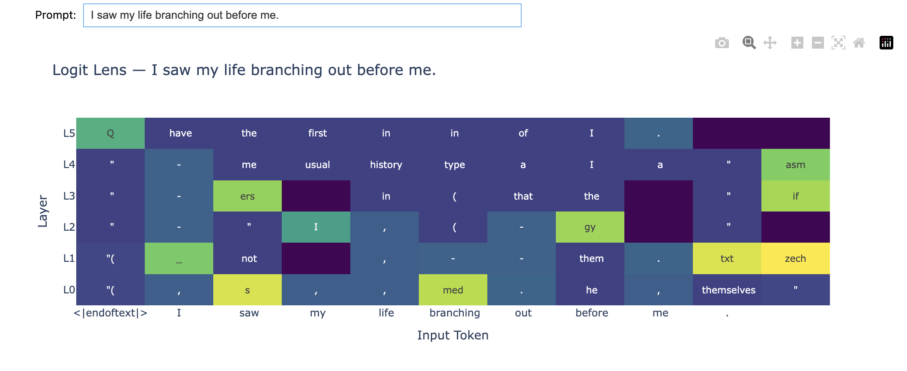
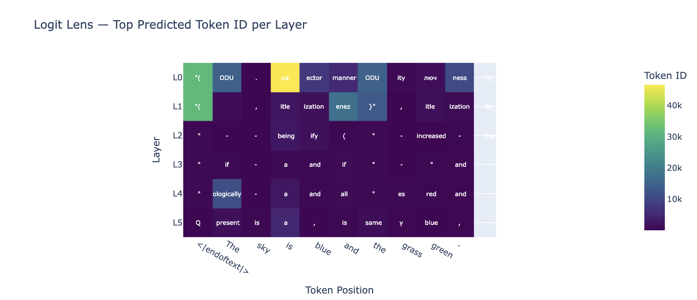
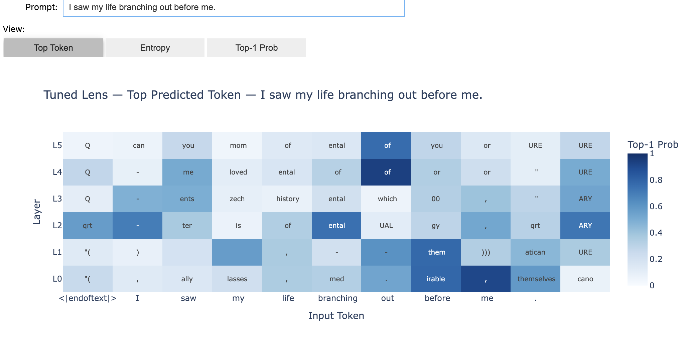
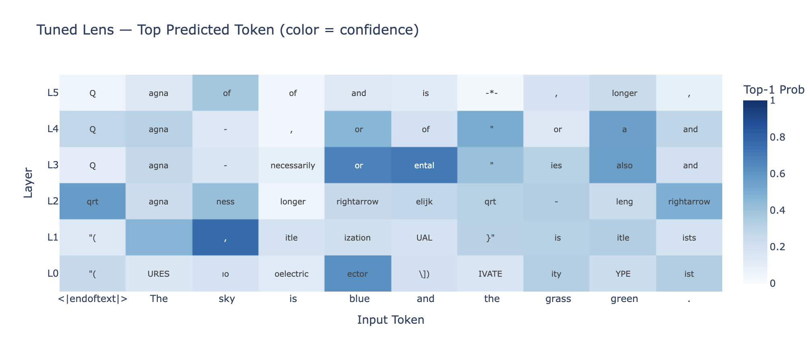

# Logit Lens & Tuned Lens Visualizer

This is my interactive implementations of logit lens and tuned lens. 

## What are these?

### Logit Lens
The logit lens (nostalgebraist, 2020) works by taking the residual stream at each layer 
and directly applying the model's final layernorm + unembedding matrix, giving us a 
"best guess" at what the model would predict if it stopped computing at that layer. 
It's a zero-cost probe, but tends to be noisy. 

### Tuned Lens
The tuned lens (Belrose et al., 2023) improves on the logit lens by training a small learned 
probe per layer. Each probe is trained to translate that 
layer's residual stream into something closer to the final layer's representation before 
unembedding. The result is cleaner, more interpretable predictions at every layer, especially in early layers where the logit lens struggles.

In this repo, the tuned lens probes are trained from scratch on Pythia-14M using a 
KL divergence loss against the final layer's output distribution.

## Visualizations









## What do we find?

A few observations jump out from these visualizations:
Early layers are mostly noise. In both the logit lens (image 3) and tuned lens (image 1), layers L0–L2 produce largely incoherent predictions, token fragments like "(, qrt, agna, URES — with no clear relationship to the input. The model hasn't built up meaningful representations yet at this depth.
But! 
The tuned lens shows more structure. By L3–L5 in images 1 and 2, predictions start to look more like plausible next tokens, conjunctions like and, or, punctuation, and short function words, even if they're not always correct. This reflects the tuned lens doing a better job of translating early residual states into vocabulary space.

## Why is this useful?

These tools give us a window into the "reasoning process" of a transformer — rather than 
treating the model as a black box that maps input to output, we can watch predictions 
evolve across depth. This is useful for:

- Understanding which layers are doing the most meaningful work
- Identifying where the model becomes confident vs. uncertain
- Detecting anomalous inputs (the tuned lens paper shows this works for adversarial 
  prompt detection)
- Building intuitions about how transformers represent information internally

## Known limitations

**Logit lens** assumes that early residual states are interpretable in the vocabulary 
space of the final layer — this is often not true, especially in early layers where 
representations are far from "final form." Results can be misleading or noisy.

**Tuned lens** is only as good as its training data and training time. The probes trained 
here are lightweight and trained on a small slice of Wikitext-2, so they won't be as 
accurate as the pretrained probes from the original paper (which no longer appear to be 
publicly hosted for small Pythia models).

Both tools show correlation, not causation — a token appearing in the logit lens at 
layer 5 doesn't necessarily mean that layer "decided" on that token. The residual stream 
is a sum of many contributions.

## Setup

Requires [uv](https://docs.astral.sh/uv/).
```bash
git clone https://github.com/LowTide-Dev/llms_lens_project.git
cd lens_code
uv venv lens-code
source lens-code/bin/activate
uv sync
jupyter notebook
```

## Models

Both notebooks run on [Pythia-14M](https://huggingface.co/EleutherAI/pythia-14m) 
via [TransformerLens](https://github.com/TransformerLensOrg/TransformerLens).

## References

- nostalgebraist. [interpreting GPT: the logit lens](https://www.lesswrong.com/posts/AcKRB8wDpdaN6v6ru/interpreting-gpt-the-logit-lens). LessWrong, 2020.
- Belrose et al. [Eliciting Latent Predictions from Transformers with the Tuned Lens](https://arxiv.org/abs/2303.08112). arXiv, 2023.